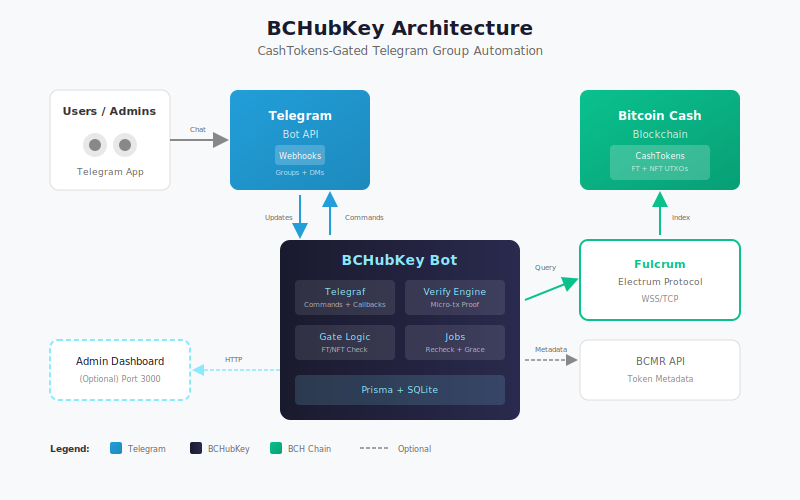

# BCHubKey

**CashTokens-Gated Telegram Group Automation Bot**

Automatically gate and manage Telegram groups based on BCH CashTokens holdings, with ownership proof and automatic enforcement.



## Requirements

- Node.js 20+
- npm

## Setup

1. Install dependencies:
   ```bash
   npm install
   ```

2. Copy environment template and configure:
   ```bash
   cp .env.example .env
   ```

3. Edit `.env` and fill in required values:
   - `TELEGRAM_BOT_TOKEN` - Get from @BotFather
   - `BOT_PUBLIC_NAME` - Your bot's username

## Development

Run in development mode with hot reload:
```bash
npm run dev
```

## Scripts

| Command | Description |
|---------|-------------|
| `npm run dev` | Start dev server with hot reload |
| `npm run build` | Compile TypeScript |
| `npm start` | Run compiled JS |
| `npm run lint` | Run ESLint |
| `npm run lint:fix` | Fix ESLint issues |
| `npm run format` | Format code with Prettier |
| `npm run format:check` | Check formatting |

## Project Structure

```
src/
├── index.ts      # Entrypoint
├── bot/          # Telegraf setup, commands, callbacks
├── domain/       # Entities, state machines, policy
├── db/           # Prisma client, repositories
├── chain/        # ChainAdapter (Fulcrum)
├── verify/       # Micro-tx verification engine
├── gate/         # Token gate evaluation + enforcement
├── jobs/         # Scheduled jobs (recheck, grace, cleanup)
├── admin/        # Optional web dashboard
└── util/         # Logging, validation, helpers
```

## Demo & Submission

### Quick Start (Demo Mode)

```bash
# Start with fast intervals for live demo
npm run demo

# Optional: Reset database for fresh demo
npm run demo:reset
```

Demo mode enables:
- 1-minute recheck interval
- 30-second grace period
- Admin dashboard at http://localhost:3000

### Submission Assets

| Document | Description |
|----------|-------------|
| [DEMO.md](./DEMO.md) | Demo script + failure playbook |
| [docs/submission/PITCH_DECK.md](./docs/submission/PITCH_DECK.md) | Pitch deck outline |
| [docs/submission/VIDEO_GUIDE.md](./docs/submission/VIDEO_GUIDE.md) | Video recording guide |
| [docs/submission/screenshots/](./docs/submission/screenshots/) | Product screenshots |
| [docs/architecture.svg](./docs/architecture.svg) | Architecture diagram |
| [docs/BRAND_KIT.md](./docs/BRAND_KIT.md) | Brand guidelines |

## Features

- **Token Gate Setup** - Admin wizard in Telegram DM
- **Ownership Proof** - Micro-tx verification (prevents address copying)
- **FT/NFT Support** - Gate by fungible token balance or NFT count
- **Auto Enforcement** - Scheduled rechecks + grace period handling
- **Admin Commands** - /settings, /members, /audit, /export, /pause, /resume

## Architecture

Built with:
- **TypeScript + Node.js 20** - Type-safe, modern runtime
- **Telegraf** - Telegram Bot API framework
- **Prisma + SQLite** - Type-safe ORM with lightweight database
- **Fulcrum** - Electrum Cash Protocol for chain queries
- **BCMR** - Token metadata resolution

### Key Components

| Component | Purpose |
|-----------|---------|
| Bot Server | Handles Telegram commands, callbacks, and wizard flows |
| Verify Engine | Micro-tx ownership proof validation |
| Gate Logic | FT/NFT balance checks and PASS/FAIL evaluation |
| Jobs | Scheduled rechecks and grace period enforcement |
| Admin Dashboard | Read-only web UI for monitoring (optional) |

### Data Flow

1. **User** clicks deep link and starts verification in DM
2. **Bot** creates verify session with unique sat amount
3. **User** sends micro-tx from their claimed address
4. **Verify Engine** polls Fulcrum for matching tx
5. **Gate Logic** checks token balance and evaluates PASS/FAIL
6. **Bot** enforces access (approve/restrict/kick) via Telegram API
7. **Jobs** periodically recheck and enforce grace periods
